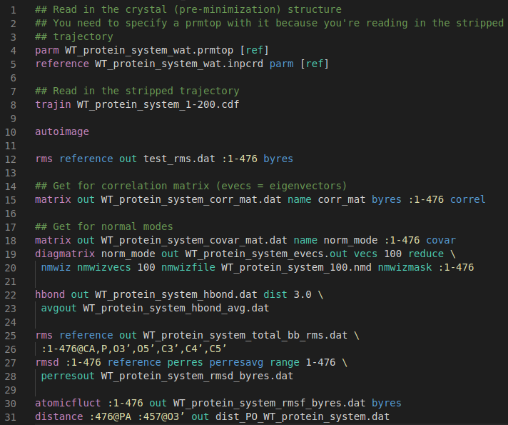

# cpptraj Syntax Highlighting for VSCode

This is a [Visual Studio Code](https://code.visualstudio.com/) 
extension to give syntax highlighting to `cpptraj`
files. It will look for .in, .traj, and .trajin file extensions.

## Related:
- `cpptraj`: https://github.com/Amber-MD/cpptraj
- `vim-cpptraj`: https://github.com/emleddin/vim-cpptraj
- `language-cpptraj` (Atom Editor): https://github.com/emleddin/language-cpptraj

